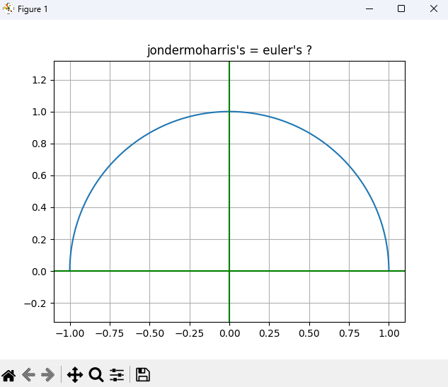

# euler-identity-visualization
Visualizing complex math through Python. My first step into engineering
# Euler Identity Visualization
This project visualizes the unit circle in the complex plane using Python. 
It's my first engineering project exploring the beauty of mathematics.

## Requirements
- Python 3.x
- Matplotlib
- Numpy
